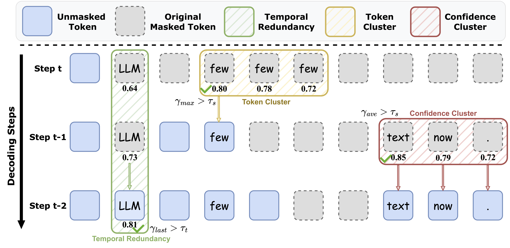

# $R^{2}$-dLLM: Accelerating Diffusion Large Language Models via Spatio-Temporal Redundancy Reduction

<a href='https://arxiv.org/abs/2604.18995'></a> 
<a href='https://huggingface.co/collections/ZhenbangDu/r2-dllm'></a>

Official code for the paper [$R^{2}$-dLLM: Accelerating Diffusion Large Language Models via Spatio-Temporal Redundancy Reduction](https://arxiv.org/abs/2604.18995).
- Authors: Zhenbang Du, Kejing Xia, Xinrui Zhong, Yonggan Fu, Nicolai Oswald, Binfei Ji, Brucek Khailany, Pavlo Molchanov, and Yingyan (Celine) Lin.

## Abstract

Diffusion Large Language Models (dLLMs) have emerged as a promising alternative to autoregressive generation by enabling parallel token prediction. However, practical dLLM decoding still suffers from high inference latency, which limits deployment. In this work, we observe that a substantial part of this inefficiency comes from recurring redundancy in the decoding process, including spatial redundancy caused by confidence clusters and positional ambiguity, and temporal redundancy caused by repeatedly remasking predictions that have already stabilized. Motivated by these patterns, we propose $R^{2}$-dLLM, a unified framework for reducing decoding redundancy from both inference and training perspectives. At inference time, we introduce training-free decoding rules that aggregate local confidence and token predictions, and finalize temporally stable tokens to avoid redundant decoding steps. We further propose a redundancy-aware supervised fine-tuning pipeline that aligns the model with efficient decoding trajectories and reduces reliance on manually tuned thresholds. Experiments demonstrate that $R^{2}$-dLLM consistently reduces the number of decoding steps by up to 88% compared to existing decoding strategies, while maintaining competitive generation quality across different models and tasks. These results validate that decoding redundancy is a central bottleneck in dLLMs, and that explicitly reducing it yields substantial practical efficiency gains.

<p align="center">
 
</p>

## Models

|Models|Base Models|Checkpoints|
|:---------|:---------|:--------|
|$R^{2}$-dLLM-LLaDA|[LLaDA-Instruct-8B](https://huggingface.co/GSAI-ML/LLaDA-8B-Instruct)|[Hugging Face](https://huggingface.co/ZhenbangDu/R2-dLLM-LLaDA)|
|$R^{2}$-dLLM-Dream|[Dream-v0-Instruct-7B](https://huggingface.co/Dream-org/Dream-v0-Instruct-7B)|[Hugging Face](https://huggingface.co/ZhenbangDu/R2-dLLM-Dream)|

## Installation

```bash
git clone https://github.com/GATECH-EIC/R2-dLLM.git
cd R2-dLLM

conda create -n r2dllm python=3.10.12
conda activate r2dllm
pip install torch==2.9.0 torchvision==0.24.0 --index-url https://download.pytorch.org/whl/cu130
pip install -r requirements.txt
```

## Repository Structure

```text
llada/   LLaDA model wrapper, R2 decoding implementation, demos, and eval scripts
dream/   Dream model wrapper, R2 decoding implementation, demos, and eval scripts
figures/ Paper figures used by this README
```

## Evaluation

### LLaDA

```bash
cd llada
bash eval_gsm8k.sh
bash eval_math.sh
bash eval_humaneval.sh
bash eval_mbpp.sh
```

The LLaDA scripts default to `GSAI-ML/LLaDA-8B-Instruct`. To evaluate the SFT checkpoint, set `model_path='ZhenbangDu/R2-dLLM-LLaDA'` in the corresponding script. To evaluate LLaDA-1.5, set `model_path='GSAI-ML/LLaDA-1.5'`.

### Dream

```bash
cd dream
bash eval_gsm8k.sh
bash eval_humaneval.sh
```

The Dream scripts default to public Dream checkpoints. To evaluate the SFT checkpoint, set `model="ZhenbangDu/R2-dLLM-Dream"` in the corresponding script. For additional lm-eval tasks such as MATH or MBPP, adapt `--tasks` following the examples in `dream/eval.md`.

### R2 Decoding Parameters

- `temporal_steps`: number of consecutive decoding attempts required for temporal redundancy reduction.
- `temporal_threshold`: confidence threshold for temporal finalization.
- `temporal_eval`: confidence aggregation strategy for temporal finalization, such as `last`, `ave`, or `max`.
- `confidence_cluster_size`: local window size for confidence-cluster aggregation.
- `spatial_threshold`: confidence threshold for spatial aggregation.
- `confidence_cluster_unmasked`: maximum number of already-unmasked tokens allowed inside a confidence window.
- `token_cluster`: position-selection rule for token-cluster aggregation, such as `confidence`, `mid`, or `random`.
- `token_cluster_size`: minimum repeated-token cluster size, currently used by the Dream implementation.

## Citation

If you find this work useful for your research, please cite:

````
@article{du2026r,
  title={$R^{2}$-dLLM: Accelerating Diffusion Large Language Models via Spatio-Temporal Redundancy Reduction},
  author={Du, Zhenbang and Xia, Kejing and Zhong, Xinrui and Fu, Yonggan and Oswald, Nicolai and Ji, Binfei and Khailany, Brucek and Molchanov, Pavlo and Lin, Yingyan},
  journal={arXiv preprint arXiv:2604.18995},
  year={2026}
}
````
